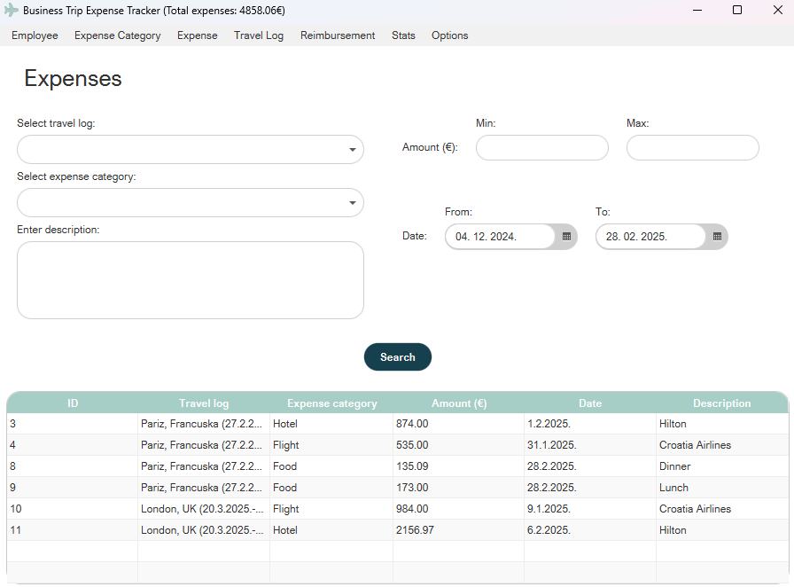
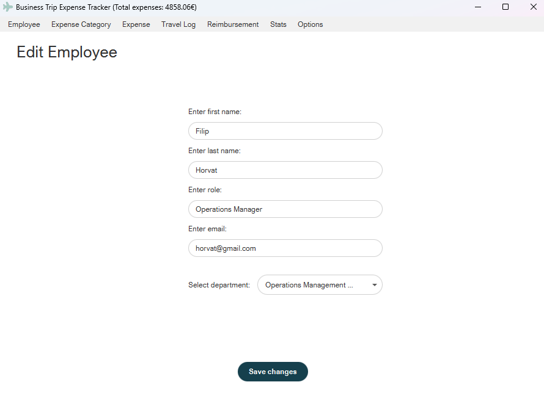

# Business Travel Expense Tracker

This is a Java-based application designed to track and manage business travel expenses, 
spending stats are visualised using graphs and charts. 
Features available to the user depend on whether they have low or high privileges.

## Table of contents
- [Features](#features)
- [Technologies used](#technologies-used)
- [Preview](#preview)
- [Setup](#setup)

## Features
* Expense and travel logging
* Expense categories
* Approval workflow
* Reimbursement tracking

## Technologies used
* Java
* JavaFX
* Maven
* Google Gson
* Password4j
* JFreeChart

## Preview

<p align="center">
<kbd></kbd>
</p>
<p align="center">
<kbd></kbd>
</p>

## Setup

Prerequisites:
- Java 23+
-  [Trip Tracker API](https://github.com/mateoo04/trip-tracker-api)

Clone the repository:

```
git clone https://github.com/mateoo04/business-travel-tracker
cd business-travel-tracker
```

Create app.properties file in the project root and define the necessary variables:
```
api.uri=value
```

Before running the application, you must start the [Trip Tracker API](https://github.com/mateoo04/trip-tracker-api) which is necessary for the application to work as intended.

Now you can run the application.
